# **spinalSynth**

## Table of Contents

1. Introduction
2. High-Level Architecture
3. Module Hierarchy
4. Master Clock
5. Timing Generators
6. Communication Protocol
7. Oscillator
   - 7.1 System Architecture
   - 7.2 Timing & Control
     - 7.2.1 DDS Update Rate
     - 7.2.2 Atomic Multi-Byte Frequency Updates
   - 7.3 Submodules
     - 7.3.1 Oscillator (Top-Level Wrapper)
     - 7.3.2 Accumulator
     - 7.3.3 Generators
     - 7.3.4 Noise
     - 7.3.5 Mux
   - 7.4 Types and Widths
   - 7.5 Oscillator Register Map
8. Envelope Generator
   - 8.1 EnvelopeGenerator: Top-Level Wrapper
   - 8.2 EnvelopeCtrl
     - 8.2.1 ADSR & Playback Modes
     - 8.2.2 Gate ON/OFF and Hard Sync
     - 8.2.3 State Machine
     - 8.2.4 AD(S)R Lengths: Time Duration Mapping
   - 8.3 EnvelopeAccumulator
   - 8.4 EnvelopeShaper
     - 8.4.1 ROM Lookup tables
     - 8.4.2 Hybrid 8+2 Bit Interpolation Math
     - 8.4.3 Multiplierless Shift-Add Implementation
9. Attenuation & Volume Control
10. Filter (State Variable Filter)
    - 10.1 Architecture
    - 10.2 Timing
    - 10.3 Modules
      - 10.3.1 SVF (Top-Level Wrapper)
      - 10.3.2 Filter Core
      - 10.3.3 Filter Mux
      - 10.3.4 Parameter Mapper
    - 10.4 Types and Widths
    - 10.5 Control Signals
    - 10.6 Filter Register Map
11. Oversampling and Decimation
12. Audio Sample Format
13. I²S Output Interface
14. Numeric Formats
15. System Parameters

Appendices
- Appendix A: Notes and Oscillator Frequency Words Reference
- Appendix B: ADSR Time Durations and Phase Increments
- Appendix C: Register Map

## Additional documents for spinalSynth:

* [Implementation_specs.md](Implementation_specs.md)  
* [Testing_specs.md](Testing_specs.md) 

<div class="page-break"></div>

---

# 1. Introduction

This project implements a compact digital audio synthesizer in SpinalHDL.

The core design integrates an oversampled Direct Digital Synthesis (DDS) oscillator, a flexible ADSR envelope generator, a multi-mode State Variable Filter (SVF), and a volume attenuator — all configurable at runtime over a UART register interface. The system produces 16-bit stereo audio serialized using the I²S protocol.

The project is intentionally designed to remain:

- compact
- deterministic
- FPGA- and ASIC-friendly
- easy to understand
- easy to simulate
- easy to extend later

## Features

- **24-bit DDS Oscillator**: Generates Saw, Square, PWM, Triangle, and Noise waveforms with 10× oversampling (480 kHz internal update rate downsampled to 48 kHz).
- **Flexible ADSR Envelope**: Supports dynamic rate mapping, four wave-shaping lookup curves (Linear, Exponential, Logarithmic, S-Curve), looping LFO mode, and hardware/software hard-sync prioritization.
- **State Variable Filter (SVF)**: Multi-mode Chamberlin filter (LP, BP, HP) with exponential cutoff and quadratic resonance mapping, state saturation protection, and cycle-accurate processing frame synchronization.
- **Control Subsystem**: UART command decoder supporting 3-byte command packets (`WriteRegister`) for dynamic runtime configuration of all parameters.
- **Timing & Output**: Single synchronous 24 MHz clock domain using clock-enable based timing generators and serialized stereo 16-bit signed I²S audio output.

## AI: ChatGPT and Gemini

The project was developed with the heavy usage of AI tools. All the specification documents were created via talking sessions to chatGPT, most of them in voice chat on the mobile with follow ups on the keyboard.

Impementation, debugging and testing was done in VSCode with the free Gemini Extension.
Later on, i switched the IDE to Antigravity and started paying for Gemini Access (Gemini Pro, Gemini Flash 3.5)

<div class="page-break"></div>

---

# 2. High-Level Architecture

```text
External Interface (24MHz Clk, Reset, UART Rx)
          ↓
        Synth (Unified Top Module)
          ↓
┌───────────────────────────────────────────────┐
│  UART Subsystem (synth.uart)                  │
│  [Uart]                                       │
│    └─ [UartRx] → [Decoder] → [RegisterBank]   │
└───────────────┬───────────────────────────────┘
                 │ oscConfig: OscConfig, envConfig: EnvelopeConfig
                ↓
┌───────────────────────────────────────────────┐
│  Synthesis, Modulation & Mixing (480 kHz)      │
│  [TimingGenerator] (synth.timing)             │
│      ├───────────────────────────────────┐    │
│      ↓                                   ↓    │
│  [Oscillator]                      [EnvelopeGenerator]
│      ↓                                   │    │
│  [envAttenuator] (10-bit Envelope) <─────┘    │
│      ↓                                        │
│  [attenuator] (8-bit Master Volume)           │
└───────────────┬───────────────────────────────┘
                │ (480 kHz Attenuated Samples)
                ↓
┌───────────────────────────────────────────────┐
│  State Variable Filter (synth.filter)         │
│  [SVF]                                        │
└───────────────┬───────────────────────────────┘
                │ (480 kHz Filtered Samples)
                ↓
┌───────────────────────────────────────────────┐
│  Oversampling Decimation                      │
│  [Decimator]  (synth.output)                  │
└───────────────┬───────────────────────────────┘
                │ (48 kHz Output Samples)
                ↓
┌───────────────────────────────────────────────┐
│  I2S Transmitter (synth.output)               │
│  [BCLK] [LRCLK] [SDATA]                       │
└───────────────────────────────────────────────┘
                ↓
       Stereo Digital Audio
```

<div class="page-break"></div>

---

# 3. Module Hierarchy

```text
Synth
 ├── common/ (Shared System Types)
 │     └── Types
 │
 ├── timing/ (Ticks Control)
 │     └── TimingGenerator
 │
 ├── uart/ (Communication Subsystem)
 │     └── Uart 
 │           ├── UartRx
 │           ├── UartProtocolDecoder
 │           └── RegisterBank
 │
 ├── oscillator/ (Sound Generating Engine)
 │     └── Oscillator
 │           ├── Accumulator
 │           ├── Generators 
 │           ├── Noise
 │           └── Mux
 │
 ├── envelope/ (Envelope Generator)
 │     └── EnvelopeGenerator
 │           ├── EnvelopeCtrl
 │           ├── EnvelopeAccumulator
 │           └── EnvelopeShaper
 │ 
 ├── mixing/ (Audio Processing)
 │     └── Attenuator (Volume Control)
 │
 ├── filter/ (State Variable Filter)
 │     └── SVF 
 │           ├── ParameterMapper
 │           ├── FilterCore
 │           └── FilterMux
 │
 └── output/ (Output Pipeline)
       ├── Decimator
       └── I2STransmitter
```

---

# 4. Master Clock

The complete design operates from a single synchronous master clock.

| Parameter | Value |
|---|---|
| Master clock frequency | 24 MHz |

No internally-generated FPGA clocks shall be used.

All submodules shall operate synchronously from the 24 MHz master clock using clock-enable tick signals.

---

# 5. Timing Generators

The TimingGenerator module shall generate two independent clock-enable tick signals.

## phaseTick

| Parameter | Value |
|---|---|
| Frequency | 480 kHz |
| Divider | 24 MHz / 50 |
| Purpose | Drive DDS phase accumulator |

The phase accumulator and waveform generation logic shall update on this tick.

---

## sampleTick

| Parameter | Value |
|---|---|
| Frequency | 48 kHz |
| Divider | 24 MHz / 500 |
| Purpose | Generate output audio samples |

The decimator and output audio sample registers shall update on this tick.

---

# 6. Communication Protocol

The system is controlled via a standard UART interface. An external controller (such as a PC or Microcontroller) sends 3-byte packets to update the internal state of the synthesizer.

## UART Configuration

| Parameter | Value |
|---|---|
| Baud Rate | 115,200 |
| Data Bits | 8 |
| Parity | None |
| Stop Bits | 1 |

## Packet Format

The `UartProtocolDecoder` expects a 3-byte sequence for every command:

1. **Command Byte**: One byte for the command. (i.e. 0x01 for "write to register")
2. **Address Byte**: Specifies which register to write to.
2. **Data Byte**: The value to be written.

## Command list

Right now there is only one command.

| Command | Name | Adress Byte | Data Byte |
|---|---|---|---|
| `0x01` | `WriteRegister` | `From Register Map` | `1 Byte` |


## Register Map

> [!NOTE]
> For the complete list of control registers and memory address offsets mapped into the `spinalSynth` control bus, please refer to [Appendix C: Register Map](#appendix-c-register-map).

---

# 7. Oscillator

The **Oscillator** is the core sound-generating engine of `spinalSynth`, designed around a oversampled Direct Digital Synthesis (DDS) architecture. It generates five standard audio waveforms (Sawtooth, Square, PWM, Triangle, and pseudo-random Noise) at an internal sampling rate of 480 kHz. The output is an 16-bit audio sample flow stream.

The design relies entirely on fixed-point arithmetic, pre-calculated Lookup ROMs, to keep it resource friendly for both FPGA and ASIC targets.

---

## 7.1 System Architecture

The architecture consists of four submodules: `Accumulator`, `Generators`, `Noise`, and `Mux`. The diagram below illustrates the connection mapping:

```text
               +--------------------------------------+
               |             Oscillator               |
phaseTick ---> |   +-------------+                    |
               |   | Accumulator |                    |
freqWord ----> |   |   (24-bit)  |                    |
               |   +------+------+                    |
               |          |                           |
               |          +------------+              |
               |          |            |              |
               |          v            v              |
               |   +------------+ +----+--------+     |
pwmWidth ----> |   | Generators | |   Noise     |     |
               |   | (Saw, Sq,  | | (23-bit     |     |
               |   |  Tri, PWM) | |  LFSR)      |     |
               |   +------+-----+ +----+--------+     |
               |          |            |              |
               |  waves   |            | noiseWave    |
               |  (Flow)  v            v              |
               |        +----------------+            |
waveSelect --->|        |      Mux       |            |
               |        +--------+-------+            |
               |                 |                    |
               +-----------------+--------------------+
                                 | sample (Flow[SInt])
                                 v
```

---

## 7.2 Timing & Control

### 7.2.1 DDS Update Rate
The oscillator operates inside the oversampled clock grid driven by the timing generator. 

- **Internal Phase Update Rate:** 480 kHz (`phaseTick` boundary)
- **Clock Synchronization:** Master system clock at 24 MHz
- **Processing Window (Frame):** 50 system clock cycles per update interval

All internal registers update precisely on the rising clock edge when `phaseTick` is active.

### 7.2.2 Atomic Multi-Byte Frequency Updates
Since the 24-bit frequency word (`freqWord`) is configured over the 8-bit UART communication protocol, updates must be performed atomically to prevent transient audio pitch glitches:
1. **OSC_FREQ_LOW (0x30):** Stages the lower 8 bits in a temporary shadow register.
2. **OSC_FREQ_MID (0x31):** Stages the middle 8 bits in a temporary shadow register.
3. **OSC_FREQ_HIGH (0x32):** Stages the upper 8 bits and commits the entire 24-bit word (`OSC_FREQ_HIGH ## OSC_FREQ_MID_Shadow ## OSC_FREQ_LOW_Shadow`) to the active synthesis registers in a single clock cycle.

*Note: Always write registers in order (`OSC_FREQ_LOW` → `OSC_FREQ_MID` → `OSC_FREQ_HIGH`) to ensure consistent updates.*

---

## 7.3 Submodules

### 7.3.1 Oscillator (Top-Level Wrapper)
The top-level `Oscillator` component instantiates the submodules and coordinates the input control signals (`config`, `phaseTick`) and output data flows. It packages the selected waveform sample into a SpinalHDL `Flow[SInt]` interface, where `valid` is tied directly to `phaseTick`.

### 7.3.2 OscAccumulator
The `OscAccumulator` implements the phase integration logic. At every clock cycle where `phaseTick` is asserted:
```text
phaseReg := phaseReg + freqWord
```
The register is initialized to `0` on reset and wraps naturally on overflow.

#### DDS Frequency Equations
The output frequency is calculated as:
```text
f = freqWord × updateRate / 2^24
```
Where:
- `updateRate` = 480,000 Hz
- `phase width` = 24 bits

The minimum frequency resolution step size is:
```text
f_step = 480,000 / 16,777,216 ≈ 0.0286 Hz
```

### 7.3.3 OscGenerators
The `OscGenerators` module contains purely combinational mathematical transformations that convert the 24-bit phase input into various bipolar waveform shapes in a signed 16-bit (`SInt`) range.

#### Sawtooth Waveform
Generated by extracting the upper 16 bits of the phase accumulator. The Most Significant Bit (MSB) is bitwise inverted (`^ 0x8000`) so the ramp starts at the negative peak (`-32768`) at phase `0`, producing a standard rising sawtooth waveform:
```text
saw = (phase[23:8] ^ 0x8000)
```

#### Square Waveform
Generated by evaluating the MSB (bit 23) of the phase accumulator to toggle between positive and negative full-scale bounds:
```text
if phase[23] == 1:
    square = +32767
else:
    square = -32768
```

#### Pulse Width Modulation (PWM) Waveform
Generated by comparing the 24-bit phase accumulator against an expanded threshold:
```text
if phase < (pwmWidth << 16):
    pwm = +32767
else:
    pwm = -32768
```
The 8-bit `pwmWidth` value is expanded to 24 bits by left-shifting it by 16 bits, enabling fine duty cycle adjustments.

#### Triangle Waveform
Generated using a reflected phase technique. The MSB of the phase indicates direction: during the first half-cycle (MSB=0), the lower 23 bits create a rising ramp; during the second half-cycle (MSB=1), they are inverted for a falling ramp. The result is shifted and centered (`^ 0x8000`) for a smooth bipolar swing:
```text
if phase[23] == 0:
    triReflected = phase[22:0]
else:
    triReflected = ~phase[22:0]

tri = (triReflected[22:7] ^ 0x8000)
```

### 7.3.4 OscNoise
The `OscNoise` generator implements a 23-bit pseudo-random Fibonacci Linear Feedback Shift Register (LFSR) updating on every `phaseTick` to avoid digital correlation loops.

- **Polynomial:** $x^{23} + x^{18} + 1$
- **Feedback Tap Equation:** `feedback = lfsr[22] ^ lfsr[17]`
- **Reset Seed:** `1` (Non-zero initialization prevents lock-up)
- **Output:** Extracted from the upper 16 bits of the LFSR (`lfsr[22:7]`) cast to a signed integer.

### 7.3.5 OscMux
The `OscMux` is a combinational output selector controlled by the 3-bit `waveSelect` register. It routes the chosen sample to the top-level module:

| waveSelect | Selected Waveform |
| :---: | :--- |
| `000` (0) | Sawtooth |
| `001` (1) | Square |
| `010` (2) | Pulse Width Modulation (PWM) |
| `011` (3) | Triangle |
| `100` (4) | Pseudo-random Noise |
| Others | Bipolar Silence (`0`) |

---

## 7.4 Types and Widths

| Item | Type | Width | Description |
| :--- | :--- | :---: | :--- |
| phase | UInt | 24 bits | Main accumulator phase |
| freqWord | UInt | 24 bits | Phase increment step size |
| pwmWidth | UInt | 8 bits | PWM duty cycle control |
| waveSelect | UInt | 3 bits | Active waveform selection index |
| waves.saw | SInt | 16 bits | Generated sawtooth output |
| waves.square | SInt | 16 bits | Generated square output |
| waves.pwm | SInt | 16 bits | Generated PWM output |
| waves.tri | SInt | 16 bits | Generated triangle output |
| noiseWave | SInt | 16 bits | Generated pseudo-random noise output |
| sample | SInt | 16 bits | Top-level output audio sample |

---

## 7.5 Oscillator Register Map

The following registers are mapped into the `spinalSynth` bus to control the Oscillator parameters:

| Register Address (Hex) | Register Name | Bit Width | Description |
| :--- | :--- | :---: | :--- |
| `0x30` | `OSC_FREQ_LOW` | 8 bits | Frequency Word Bits `[7:0]` (Lower byte of 24-bit DDS step) |
| `0x31` | `OSC_FREQ_MID` | 8 bits | Frequency Word Bits `[15:8]` (Middle byte of 24-bit DDS step) |
| `0x32` | `OSC_FREQ_HIGH` | 8 bits | Frequency Word Bits `[23:16]` (Upper byte of 24-bit DDS step; commit trigger) |
| `0x33` | `OSC_WAVE_SEL` | 8 bits | Active waveform selection index (`0`=Saw, `1`=Square, `2`=PWM, `3`=Triangle, `4`=Noise) |
| `0x34` | `OSC_PWM_WIDTH` | 8 bits | PWM duty cycle control value (scaled dynamically to 24-bit comparison range) |
| `0x35` | `OSC_VOLUME` | 8 bits | Master output volume / output attenuation |

---

# 8. Envelope Generator

The **Envelope Generator** is a control module designed to shape the volume (amplitude) or other modulation parameters of a sound over time. The general design principle is an ADSR engine.

When a key is pressed (Gate ON), the envelope rises to peak volume (Attack), decays slightly to a steady volume (Decay and Sustain), and then fades to silence when the key is released (Release). 

This module generates envelopes with a 10-bit resolution (0 to 1023) output value, which can be used as a volume (or other modulation) signal.

The entire module is designed with ASIC portability in mind, meaning it uses no specific hardware multipliers or memory blocks. Instead, it relies on compile-time Scala calculators to generate look-up curves in ROM, and performs most intermediate steps using bit-shifts and additions.

---

## 8.1 EnvelopeGenerator: Top-Level Wrapper

The top-level `EnvelopeGenerator` module integrates the submodules and registers them to the system communication and audio pipelines.

### System Diagram
```text
+-------------------------------------------------------------+
| EnvelopeGenerator (Top-Level)                               |
|                                                             |
|  Sync In ────┬─> [ EnvelopeCtrl ]                           |
|  Regs In ────┘        │ (SM, Sync, Rate LUTs)               |
|  (config)             │                                     |
|                       v Increment / Reset                   |
|                  [ EnvelopeAccumulator ]                    |
|                       │ (32-bit Phase Counter)              |
|                       │                                     |
|                       ├───> Base Index (8-bit) ────┐        |
|                       └───> Fraction (2-bit) ────┐ │        |
|                                                  v v        |
|  Phase Tick ──────> [   EnvelopeShaper   ] <─────┴─┘        |
|                       │ (257-word ROMs, Shift-Add)          |
|                       │                                     |
|             ┌─────────┴─────────┐                           |
|             v                   v                           |
|        envelopeOut       envelopeOutSigned                  |
|        Flow[UInt]        Flow[SInt]                         |
|        (0 to 1023)       (-512 to +511)                     |
+-------------------------------------------------------------+
```

### Module Interface (I/O Ports)
The top-level `EnvelopeGenerator` operates directly on the 24 MHz main system clock and exposes the following SpinalHDL hardware IO bundle:

```scala
val io = new Bundle {
  val phaseTick = in Bool()                 // 480 kHz audio rate tick
  val syncIn    = in Bool()                 // Trigger for Hard Sync
  val config    = in(EnvelopeConfig())      // Packaged register configurations

  val envelopeOut       = master(Flow(UInt(10 bits))) // Unipolar output (0 to 1023)
  val envelopeOutSigned = master(Flow(SInt(10 bits))) // Bipolar output (-512 to +511)
}
```

* **Unipolar Output (envelopeOut):** Emits unsigned 10-bit values (0 to 1023) for standard amplitude scaling or unipolar modulation. The flow's `valid` signal is synchronized to `phaseTick` (480 kHz heartbeat).
* **Bipolar Output (envelopeOutSigned):** Emits signed 10-bit values (-512 to +511) for ring modulation, phase modulation, or center-zero pitch modulations. The flow's `valid` signal is synchronized to `phaseTick` (480 kHz heartbeat).

### The EnvelopeConfig Bundle
Following the consistent design patterns of the synthesizer's components, the parameter configuration is packaged into a unified Scala bundle under the `synth.common` package:

```scala
case class EnvelopeConfig() extends Bundle {
  val ctrl        = Bits(8 bits)
  val attack      = UInt(8 bits)
  val decay       = UInt(8 bits)
  val sustain     = UInt(8 bits)
  val release     = UInt(8 bits)
  val gate        = Bits(8 bits)
}
```

### Register Map
The following registers are mapped into the `spinalSynth` SPI/UART register bus to control the Generator parameters:

| Register Address (Hex) | Register Name | Bit Width | Description |
| :--- | :--- | :---: | :--- |
| `0x40` | `ENV_CTRL` | 8 bits | Control bits: <br> `[0]` `ENV_DISABLE` (`0`=active/enabled, `1`=disabled), <br> `[1]` `ENV_BYPASS` (`0`=active modulation, `1`=bypass modulation), <br> `[2]` `ENV_LOOP` (`0`=single-shot, `1`=loop), <br> `[3]` `ENV_HARDSYNC_EN` (`0`=hard sync disabled, `1`=hard sync enabled), <br> `[5:4]` `ENV_CURVE` (`00`=Lin, `01`=Exp, <br> `10`=Log, `11`=S-Curve) |
| `0x41` | `ENV_ATTACK` | 8 bits | Attack rate (time duration mapped) |
| `0x42` | `ENV_DECAY` | 8 bits | Decay rate (time duration mapped) |
| `0x43` | `ENV_SUSTAIN` | 8 bits | Sustain Level |
| `0x44` | `ENV_RELEASE` | 8 bits | Release rate (time duration mapped)|
| `0x45` | `ENV_GATE` | 8 bits | Gate/Sync triggers: <br> `[0]` Gate ON/OFF, <br> `[1]` Software Hard Sync |

Bits that do not appear in the mapping above are just unused right now.

---

## 8.2 EnvelopeCtrl

`EnvelopeCtrl` is the state machine and synchronization module that determines the active phase increment values and the play direction.

### 8.2.1 ADSR & Playback Modes
There are different modes for the ADSR playback envelopes and shapes:
* **Normal (One-Shot):** Triggers on Gate ON, transitions from Attack to Decay to Sustain, and goes to Release on Gate OFF.
* **Looping (LFO Mode):** The envelope automatically loops back to the start of the Attack phase once the Decay phase finishes.

```text
  Normal (One-Shot):
   Gate   : ┌────────────────┐
            │                └───────────────────
   Output :   /\_____________
             /  \            \
            /    \____________\
             A   D     S      R

  Looping (LFO Mode):
   Gate   : ┌────────────────────────────────────────────
            │
   Output :   /\  /\  /\  /\  /\  /\  /\  /\
             /  \/  \/  \/  \/  \/  \/  \/  \ ...
             A   D  A   D  A   D  A   D  A   D

```

### 8.2.2 Gate ON/OFF and Hard Sync
* **Gate ON:** Triggers the ADSR envelope to start from the ATTACK phase.
* **Gate OFF:** Triggers the ADSR envelope to go to the RELEASE phase.
* **Hard Sync:** Trigger to instantly reset the Accumulator and send the state machine to ATTACK.

For the exact transitions see the state machine diagram below.

### 8.2.3 State Machine

```mermaid
%%{init: { 'themeVariables': { 'fontSize': '18px' } } }%%
stateDiagram-v2
    direction LR
    %% Main Happy Path (Linear ADSR Sequence)
    [*] --> IDLE: Power-On
    %% Note to document the global interrupt resets to avoid arrow clutter
    note left of IDLE
      <b>Global:</b>
      • hardSync triggers 
      ATTACK from any state.
      • Gate OFF triggers 
      RELEASE from 
      ATTACK/DECAY/SUSTAIN.
    end note
    IDLE --> ATTACK: Gate ON
    ATTACK --> DECAY: segmentDone
    DECAY --> SUSTAIN: segmentDone\n(No Loop)
    SUSTAIN --> RELEASE: Gate OFF
    RELEASE --> IDLE: segmentDone
    %% Alternative Paths & Loops
    DECAY --> ATTACK: segmentDone\n(Loop Mode)
    RELEASE --> ATTACK: Gate ON
    

```



### 8.2.4 AD(S)R Lengths: Time Duration Mapping
In synthesizer design, how parameter values map to actual time durations directly determines the musical feel of the instrument. 

#### Why Linear Mapping Fails
If we map the 8-bit parameters (0 to 255) of the Attack, Decay and Release registers to time durations linearly, we encounter severe playing issues:
* **Linear Time Mapping:** If time increases linearly up to 30.0 seconds, the first step is already 117 milliseconds. This completely wipes out snappy, high-energy percussion attacks (which require precise control between 1 ms and 50 ms).
* **Linear Increment Mapping:** Mapping step size (increment) linearly creates a hyperbola where most of the range is crammed into tiny millisecond adjustments at the fast end, making it practically impossible to select slow durations with any precision.

#### The Logarithmic Solution
To match human hearing perception, we use a **logarithmic time mapping** (exponential increments). This splits the 8-bit parameter range into three playable musical zones:
* **Register Values 0 to 100:** Snappy transients (0.5 ms to 200 ms) with sub-millisecond precision.
* **Register Values 100 to 200:** Medium decay and release controls (200 ms to 3.0 seconds).
* **Register Values 200 to 255:** Very slow, evolving ambient sweeps (3.0 seconds to 30.0 seconds).

#### Hardware Implementation: Pre-Calculated ROM
Calculating logarithmic curves or exponential step values at runtime is expensive in ASIC silicon, requiring division blocks and exponential math units. 

To maintain ASIC portability, we pre-calculate the 256 increment step values in Scala at compile-time. When a parameter register (Attack, Decay, or Release) is written, the system simply uses the 8-bit value to index a static lookup ROM (256 words x 22-bit width) to retrieve the accumulator step size instantly.

```text
System Specifications:
  mainClock        = 24 MHz system clock
  T_min            = 0.5 ms (0.0005 seconds)
  T_max            = 30.0 seconds
  Accumulator Width = 32 bits (10 bits integer + 22 bits fraction)
  Increment Width   = 22 bits

Mathematical Model:
  T(P)             = T_min * (T_max / T_min) ^ (P / 255)
  increment(P)     = 2^32 / (T(P) * 24,000,000)
```

---

## 8.3 EnvelopeAccumulator

The `EnvelopeAccumulator` acts as the time-tracking motor of the envelope generator, capable of counting in both directions (forward and reverse) depending on the active stage.

### How the Accumulator works
The accumulator is a 32-bit register. On every master clock cycle (24 MHz), the accumulator adds (or subtracts) the active 22-bit phase increment value:
* **Attack (Stage 1)**: Counts UP (`accumDir = 0`). `segmentDone` triggers when it overflows past `1023` (representing index 255).
* **Decay (Stage 2)**: Counts DOWN (`accumDir = 1`). `segmentDone` triggers when the integer `baseIndex` matches or crosses below `sustainLevel` (using an 8-bit hardware comparator).
* **Sustain (Stage 3)**: Paused (`runAccum = 0`), naturally holding the output stable at `sustainLevel` without any pipeline registers.
* **Release (Stage 4)**: Counts DOWN (`accumDir = 1`). `segmentDone` triggers when it underflows (representing `baseIndex` reaching `0`).

### Clock and Frequency Boundaries
At the 24 MHz main clock rate with a 32-bit accumulator and 22-bit phase increment, the exact operational limits are calculated as follows:

| Target Speed Limit | Time Duration | Active Clock Cycles | Calculated Increment (Decimal) | Increment (Hexadecimal) |
| :--- | :--- | :--- | :--- | :--- |
| **Maximum Speed (T_min)** | 0.5 milliseconds | 12,000 cycles | **357,914** | 0x05761A |
| **Minimum Speed (T_max)** | 30.0 seconds | 720,000,000 cycles | **6** | 0x000006 |

### Hardware Phase Specifications
* **Accumulator Size:** Uses a 32-bit phase accumulator (10 bits integer + 22 bits fraction).
* **Segment Limits:** Evaluated dynamically based on FSM state (`overflow` for Attack, `baseIndex <= sustainLevel` for Decay, `underflow` for Release).
* **Output Splitting:** Splits the upper 10 integer bits of the active 32-bit phase (bits 31 to 22) into two fields to drive the waveshaper:
  * **Base Index:** The higher 8 bits of the integer part (bits 31 to 24), representing the active step index (0 to 255).
  * **Fractional Part:** The lower 2 bits of the integer part (bits 23 to 22), representing the interpolation fraction (0 to 3).

---

## 8.4 EnvelopeShaper

The `EnvelopeShaper` is the output stage of the envelope generator. 

It takes the raw, linear ramp outputs from the accumulator and transforms them into customized, musically natural curves. It reads two consecutive points from a 257-entry curve ROM (Lin, Exp, Log, S-Curve) based on the 8-bit Base Index, performs linear interpolation in pure multiplierless combinational logic using the 2-bit fraction, and outputs unipolar/bipolar audio-rate flows.

### 8.4.1 ROM Lookup tables
The Base Index (upper 8 bits) addresses lookup curves from pre-calculated 257-word ROMs (257 x 8 bits) using these profiles:

| Curve Model | Description | Primary Audio Application |
| :--- | :--- | :--- |
| **Linear (Lin)** | Perfectly straight transition lines. | LFO sweeps, pitch modulation, physical modeling. |
| **Exponential (Exp)** | Accelerating curve start, mimicking natural capacitor discharge. | Snappy percussion envelopes, natural string plucks. |
| **Logarithmic (Log)** | Rapid initial rise followed by gradual flattening. | High-energy attack dynamics, volume compensation. |
| **S-Curve (Sigmoid)** | Smooth cosine-like ease-in and ease-out transitions. | Smooth organic sweeps, cinematic pads, crossfading. |

#### The 257-Entry ROM Boundary Safeguard
To calculate Y1 = LUT[x+1] when the base index is at its boundary (x = 255) without conditional bounds checking or wrapping, the curve ROM is constructed with **257 entries** (indices 0 to 256). For x = 255, LUT[x+1] safely returns LUT[256], containing the true terminal amplitude value.

### 8.4.2 Hybrid 8+2 Bit Interpolation Math
Using the splits from the 10 bits accumulator output:
* The 8-bit Base Index looks up the boundary values Y0 = LUT[x] and Y1 = LUT[x+1].
* The 2-bit fraction f represents step fractions {0, 1/4, 2/4, 3/4}.
* **Interpolation**: Evaluates `Y = Y0 + (f / 4) * (Y1 - Y0)`.
* **Reverse Gating**: When counting backwards (`accumDir = 1` during Decay and Release), the 2-bit fractional index is mirrored combinationally:
  `fractionAdjusted = accumDir ? (3 - fraction) : fraction`
  This guarantees that interpolation sweeps smoothly and linearly downward in both directions.

### 8.4.3 Multiplierless Shift-Add Implementation
The fractional calculation is implemented in pure combinational shift-add logic:

| Fractional Bits (f_adjusted) | Fraction Value | Hardware Shift-Add Expression |
| :---: | :---: | :--- |
| `00` | 0.00 | Y0 |
| `01` | 0.25 | Y0 + (delta Y >> 2) |
| `10` | 0.50 | Y0 + (delta Y >> 1) |
| `11` | 0.75 | Y0 + (delta Y >> 1) + (delta Y >> 2) |

Since the accumulator physically halts at `sustainLevel` during Sustain and counts backwards naturally during Decay and Release, **no multipliers or sustain delay pipelines are required**, making the output stage extremely area-efficient.

---

# 9. Attenuation & Volume Control

Volume level control is performed at the oversampled 480 kHz rate prior to decimation by the `Attenuator` module. To maximize reusable modularity (e.g., interfacing with an 8-bit manual volume register or a 10-bit dynamic envelope generator output), the `Attenuator` is designed as a compile-time parameterized component:

* **Compile-Time Parameter:** `volumeWidth: Int = 8`
* **Inputs:** `io.volume: UInt(volumeWidth bits)`, `io.phaseTick: Bool` (480 kHz grid strobe)
* **Mathematical Operation:** 
  ```text
  scaledSample = (sampleIn * volumeSigned) >> volumeWidth
  ```
  This is implemented efficiently in hardware using a single signed multiplier and bitwise shift scaling. To align the output flow properly with downstream blocks, the `sampleOut.valid` strobe is synchronized combinationally to the next `phaseTick` edge, introducing exactly 1 sample (1 `phaseTick` period) of latency.

---

# 10. Filter (State Variable Filter)

The Filter Module processes audio samples within the spinalSynth signal path.

The module architecture shall allow future filter core implementations without changing the external interface.

---

## 10.1 Architecture

```text id="a1k9qv"
                     +----------------+
sampleIn ----------> |                |
phaseTick ---------> |      SVF       | ---------> sampleOut
enable ------------> |                |
mode --------------> |                |
cutoff ------------> |                |
resonance ---------> |                |
                     +----------------+
                              |
          +-------------------+-------------------+
          |                   |                   |
          v                   v                   v

 +----------------+   +--------------+   +-------------+
 | ParameterMapper|   |  FilterCore  |   |  FilterMux  |
 +----------------+   +--------------+   +-------------+
 | cutoff         |-->| cutoffCoeff  |-->| mode        |
 | resonance      |-->| resonanceCoeff|  +-------------+
 +----------------+   +--------------+
                              |
                        +-----+-----+
                        |     |     |
                        |     |     +---- LP
                        |     +---------- BP
                        +---------------- HP
```

---

## 10.2 Timing

### Main system clock

| Signal | Frequency |
| ------ | --------- |
| clk    | 24 MHz    |

### External: Sample Interface Sync

The Filter Module receives and transmits audio samples at a rate of 480 kHz. Input and output samples are transferred using SpinalHDL `Flow` interfaces. A dedicated input signal `phaseTick` is provided.

| Signal    | Rate    |
| --------- | ------- |
| phaseTick | 480 kHz |

The input and output Flow interfaces are synchronized to `phaseTick`. All signals remain synchronous to the 24 MHz main system clock.

### Internal: Processing frame

One frame of the external sample sync is 50 main clock cycles long. Calculations can be distributed across multiple system clock cycles during this. Internal processing is not required to use a fully parallel or serial datapath; mixed design is allowed.

---

## 10.3 Modules

### 10.3.1 SVF (Top-Level Wrapper)

`SVF` combines `FilterCore`, `FilterMux`, and `ParameterMapper`, and handles the connection of all input and output signals.

### 10.3.2 Filter Core

`FilterCore` is a Chamberlin State Variable Filter (SVF). It supports runtime adjustment of:

* Cutoff
* Resonance

and it provides these outputs simultaneously:

* Lowpass (`lp`)
* Bandpass (`bp`)
* Highpass (`hp`)

The name SVF (State Variable) refers to two of these passes being internal state variables:

* Lowpass state (`lp`)
* Bandpass state (`bp`)

#### Calculation

For each input sample, the Highpass (`hp`), Bandpass (`bp`) and Lowpass (`lp`) outputs are calculated from the current filter states, and then the states are updated.

Basic equations:

```text id="g7m2xa"
hp = input - lp - resonance * bp
bp = bp + cutoff * hp
lp = lp + cutoff * bp
```

Per sample, the filter requires:

* 3 multiplications
* 4 add/sub operations

The algorithm operates entirely on fixed-point values and uses only:

* Registers
* Adders/Subtractors
* Multipliers

Multiplier results use extended precision internally. After each multiplication, the result shall be rescaled (downshifted) to the internal state width before being used in subsequent calculations or written back into a state register.

The internal state width remains constant throughout the filter pipeline and shall not grow between processing stages.

#### Example Width Propagation

```text id="r9k2mp"
bp(24) * resonance(8)
    -> 32 bit product
    -> downshift by 8
    -> 24 bit result

input(16)
    -> sign extend
    -> 24 bits

input(24) - lp(24)
    -> 25 bit result

(input - lp)(25) - resBp(24)
    -> 26 bit result

resize
    -> hp(24)

hp(24) * cutoff(12)
    -> 36 bit product
    -> downshift by 12
    -> 24 bit result

bp(24) + scaledProduct(24)
    -> 25 bit result

resize
    -> bp(24)

bp(24) * cutoff(12)
    -> 36 bit product
    -> downshift by 12
    -> 24 bit result

lp(24) + scaledProduct(24)
    -> 25 bit result

resize
    -> lp(24)
```

Arithmetic operations may temporarily increase signal widths. Before values are stored into state registers or used as the next state variable, they shall be resized to the defined internal state width.

The state registers `lp` and `bp` remain 24 bits wide throughout operation.

### 10.3.3 Filter Mux

`FilterMux` is responsible for output selection. The initial implementation shall support selection of:

* Lowpass
* Bandpass
* Highpass

responses.

It is also responsible for downsizing the internal 24-bit representation back to the 16-bit output. To prevent harsh wrap-around distortion when filter outputs exceed 16-bit signed boundaries (due to filter peaking or phase-shift overshoot), the module shall apply a saturating clamp to output values, limiting output samples strictly to `[-32768, 32767]`.

### 10.3.4 Parameter Mapper

`ParameterMapper` converts user-facing parameters into internal filter coefficients.

#### Cutoff Mapping

* Input: `UInt(8)`
* Output: `UInt(12)`
* ROM: `256 x 12`
* Mapping: exponential (log-like frequency distribution)

#### Resonance Mapping

* Input: `UInt(8)`
* Output: `UInt(8)`
* ROM: `256 x 8`
* Mapping: quadratic response curve

---

## 10.4 Types and Widths

| Item           | Type          |
| -------------- | ------------- |
| sampleIn       | SInt(16 bits) |
| sampleOut      | SInt(16 bits) |
| lp state       | SInt(24 bits) |
| bp state       | SInt(24 bits) |
| hp signal      | SInt(24 bits) |
| cutoff         | UInt(8 bits)  |
| resonance      | UInt(8 bits)  |
| cutoffCoeff    | UInt(12 bits) |
| resonanceCoeff | UInt(8 bits)  |

---

## 10.5 Control Signals

| Signal | Type         |
| ------ | ------------ |
| enable | Bool         |
| mode   | UInt(2 bits) |

Mode encoding:

| Value | Response |
| ----- | -------- |
| 00    | Lowpass  |
| 01    | Bandpass |
| 10    | Highpass |
| 11    | Reserved |

The control signals are inputs to the top-level `SVF` module and distributed internally.

When `FILTER_DISABLE` is asserted (set to 1), the module output shall be zero.

Bypass functionality is handled at the toplevel `Synth.scala` multiplexer, routing audio around the SVF module when `FILTER_BYPASS` is active.

---

## 10.6 Filter Register Map

The following registers are mapped into the `spinalSynth` bus to control the SVF parameters:

| Register Address (Hex) | Register Name | Bit Width | Description |
| :--- | :--- | :---: | :--- |
| `0x50` | `FILTER_CTRL` | 8 bits | Bit `[0]`: `FILTER_DISABLE` (`0`=active/enabled, `1`=disabled), <br> Bit `[1]`: `FILTER_BYPASS` (`0`=filter in audio path, `1`=bypass filter) |
| `0x51` | `FILTER_MODE` | 8 bits | Bits `[1:0]`: Response Mode (`00`=LP, `01`=BP, `10`=HP, `11`=Reserved) |
| `0x52` | `FILTER_CUTOFF` | 8 bits | 8-bit user cutoff value (mapped exponentially) |
| `0x53` | `FILTER_RESONANCE` | 8 bits | 8-bit user resonance value (mapped quadratically) |

---

# 11. Oversampling and Decimation

## Oversampling Strategy

The oscillator shall internally operate at:

```text
480 kHz
```

while the final audio output sample rate shall be:

```text
48 kHz
```

This creates an oversampling ratio of:

```text
10×
```

---

## Decimation Strategy

The implementation shall use simple zero-order decimation.

Every 10th sample shall be captured as the output audio sample.

No interpolation or low-pass filtering shall initially be used.

Example:

```text
if(sampleTick) {
    audioSample := oscSample
}
```

---

# 12. Audio Sample Format

| Parameter | Value |
|---|---|
| Audio width | 16 bit |
| Sample format | Signed |
| Sample rate | 48 kHz |

Example:

```scala
val sample = SInt(16 bits)
```

The oscillator is currently mono internally.

The mono signal shall be duplicated to both stereo output channels.

Example:

```text
leftSample  = sample
rightSample = sample
```

---

# 13. I²S Output Interface

The output interface shall use the I²S protocol.

## I²S Timing Architecture

The I²S transmitter shall operate directly from the 24 MHz master clock. The transmitter shall use a cycle-timed state machine architecture.

---

## I²S Bit Timing

The required I²S bit clock frequency BCLK is:

```text
48,000 × 2 × 16 = 1.536 MHz
```

The relationship to the 24 MHz master clock is:

```text
24 MHz / 1.536 MHz = 15.625
```

Therefore no integer divider exists.

The serializer shall therefore alternate between:

- 15 master-clock cycles
- 16 master-clock cycles

between serialized bit transfers.

---

## I²S Timing Subpattern

The serializer shall use the following repeating 8-step timing subpattern:

```text
16,16,15,16,16,15,16,15
```

This subpattern contains:

| Interval | Count |
|---|---|
| 16-cycle intervals | 5 |
| 15-cycle intervals | 3 |

Total clocks:

```text
16+16+15+16+16+15+16+15 = 125
```

Average clocks per bit:

```text
125 / 8 = 15.625
```

This exactly matches the required average I²S bit timing.

---

## Relationship To LRCLK Period

One stereo I²S frame contains:

```text
32 serial bits
```

because:

- 16 left-channel bits
- 16 right-channel bits

Since:

```text
32 = 4 × 8
```

the 8-step timing subpattern repeats exactly four times during one complete stereo frame.

Full frame timing:

```text
[16,16,15,16,16,15,16,15] × 4
```

Total master-clock cycles per stereo frame:

```text
4 × 125 = 500
```

Stereo frame rate:

```text
24 MHz / 500 = 48 kHz
```

This produces the exact required audio sample rate.

---

## I²S Timing State Machine

The serializer shall internally contain:

| Register | Purpose |
|---|---|
| cycleCounter | Current interval countdown |
| patternIndex | Selects 15/16-cycle interval |
| bitCounter | Counts serialized bits |
| shiftRegister | Serialized audio data |

The pattern index shall cycle continuously:

```text
0 → 1 → 2 → ... → 7 → 0
```

The bit counter shall cycle:

```text
0 → 1 → 2 → ... → 31 → 0
```

The bit counter determines:

- LRCLK state
- stereo frame boundaries
- sample reload timing

---

## I²S Audio Format

| Parameter | Value |
|---|---|
| Channels | 2 |
| Audio width | 16 bit |
| Sample rate | 48 kHz |
| Bit clock | 1.536 MHz |

---

## I²S Signals

| Signal | Description |
|---|---|
| i2s_bclk | Bit clock |
| i2s_lrclk | Left/right word select |
| i2s_sdata | Serial audio data |

---

## Serializer Behavior

The I²S serializer shall:

- shift audio data 
- serialize stereo audio samples
- generate LRCLK framing
- output signed 16-bit audio samples

The exact serializer state machine behavior is not yet specified.

---

# 14. Numeric Formats

| Signal | Type |
|---|---|
| phase | UInt(24 bits) |
| freqWord | UInt(24 bits) |
| pulseWidth | UInt(8 bits) |
| audioSample | SInt(16 bits) |
| volume | UInt(volumeWidth bits) | (Defaults to 8 bits in top-level Synth integration)
| lp state | SInt(24 bits) |
| bp state | SInt(24 bits) |
| hp signal | SInt(24 bits) |

The design shall use fixed-point arithmetic throughout.

### Grouped Bundles & Flow Interfaces

| Bundle | Subfields | Type |
|---|---|---|
| **RegisterWrite** | `address` <br> `data` | UInt(8 bits) <br> Bits(8 bits) |
| **OscConfig** | `freqWord` <br> `waveSelect` <br> `pwmWidth` <br> `volume` | UInt(24 bits) <br> UInt(3 bits) <br> UInt(8 bits) <br> UInt(8 bits) |
| **OscWaveforms** | `saw` <br> `square` <br> `pwm` <br> `tri` | SInt(16 bits) <br> SInt(16 bits) <br> SInt(16 bits) <br> SInt(16 bits) |

---

# 15. System Parameters

| Parameter | Value |
|---|---|
| HDL | SpinalHDL |
| Master clock | 24 MHz |
| DDS phase width | 24 bit |
| DDS update rate | 480 kHz |
| Audio sample rate | 48 kHz |
| Audio width | 16 bit signed |
| I²S output | Stereo |
| I²S bit clock | 1.536 MHz |
| Oversampling ratio | 10× |
| Decimation method | Every 10th sample |
| Filter | State Variable Filter (SVF) |
| Filter modes | Lowpass, Bandpass, Highpass |
| Arithmetic | Fixed-point |
| Waveforms | Saw, Square, PWM, Triangle, Noise |
| Clocking strategy | Single synchronous clock domain |


<div class="page-break"></div>

---

# Appendices

## Appendix A: Notes and Oscillator Frequency Words Reference

This table provides the mapping between musical notes (C0 to C8), their fundamental frequencies, and the corresponding 24-bit `freqWord` values required for the Oscillator DDS engine.

**System Parameters:**
- Phase Update Rate: 480 kHz
- Phase Width: 24 bits
- Tuning: A4 = 440 Hz

| Note | Freq (Hz) | Hex | Dec | | Note | Freq (Hz) | Hex | Dec |
| :--- | :--- | :--- | :--- | :---: | :--- | :--- | :--- | :--- |
| **C0** | 16.35 | `0x00023B` | 571 | | **C4** | 261.63 | `0x0023B2` | 9138 |
| C#0 | 17.32 | `0x00025D` | 605 | | C#4 | 277.18 | `0x0025CD` | 9677 |
| D0 | 18.35 | `0x000281` | 641 | | D4 | 293.66 | `0x00280D` | 10253 |
| D#0 | 19.45 | `0x0002A7` | 679 | | D#4 | 311.13 | `0x002A76` | 10870 |
| E0 | 20.60 | `0x0002D0` | 720 | | E4 | 329.63 | `0x002D05` | 11525 |
| F0 | 21.83 | `0x0002FB` | 763 | | F4 | 349.23 | `0x002FBA` | 12218 |
| F#0 | 23.12 | `0x000328` | 808 | | F#4 | 369.99 | `0x00328E` | 12942 |
| G0 | 24.50 | `0x000358` | 856 | | G4 | 392.00 | `0x00358A` | 13706 |
| G#0 | 25.96 | `0x00038B` | 907 | | G#4 | 415.30 | `0x0038B4` | 14516 |
| A0 | 27.50 | `0x0003C1` | 961 | | A4 | 440.00 | `0x003C13` | 15379 |
| A#0 | 29.14 | `0x0003FA` | 1018 | | A#4 | 466.16 | `0x003FA7` | 16295 |
| B0 | 30.87 | `0x000436` | 1078 | | B4 | 493.88 | `0x004368` | 17256 |
| **C1** | 32.70 | `0x000476` | 1142 | | **C5** | 523.25 | `0x004764` | 18276 |
| C#1 | 34.65 | `0x0004B9` | 1209 | | C#5 | 554.37 | `0x004B99` | 19353 |
| D1 | 36.71 | `0x000502` | 1282 | | D5 | 587.33 | `0x00501B` | 20507 |
| D#1 | 38.89 | `0x00054F` | 1359 | | D#5 | 622.25 | `0x0054EC` | 21740 |
| E1 | 41.20 | `0x0005A1` | 1441 | | E5 | 659.26 | `0x005A0B` | 23051 |
| F1 | 43.65 | `0x0005F7` | 1527 | | F5 | 698.46 | `0x005F73` | 24435 |
| F#1 | 46.25 | `0x000652` | 1618 | | F#5 | 739.99 | `0x00651D` | 25885 |
| G1 | 49.00 | `0x0006B1` | 1713 | | G5 | 783.99 | `0x006B14` | 27412 |
| G#1 | 51.91 | `0x000717` | 1815 | | G#5 | 830.61 | `0x007168` | 29032 |
| A1 | 55.00 | `0x000783` | 1923 | | A5 | 880.00 | `0x007827` | 30759 |
| A#1 | 58.27 | `0x0007F5` | 2037 | | A#5 | 932.33 | `0x007F4E` | 32590 |
| B1 | 61.74 | `0x00086D` | 2157 | | B5 | 987.77 | `0x0086CF` | 34511 |
| **C2** | 65.41 | `0x0008ED` | 2285 | | **C6** | 1046.50 | `0x008EC9` | 36553 |
| C#2 | 69.30 | `0x000973` | 2419 | | C#6 | 1108.73 | `0x009733` | 38707 |
| D2 | 73.42 | `0x000A03` | 2563 | | D6 | 1174.66 | `0x00A035` | 41013 |
| D#2 | 77.78 | `0x000A9D` | 2717 | | D#6 | 1244.51 | `0x00A9D8` | 43480 |
| E2 | 82.41 | `0x000B41` | 2881 | | E6 | 1318.51 | `0x00B416` | 46102 |
| F2 | 87.31 | `0x000BEE` | 3054 | | F6 | 1396.91 | `0x00BEE7` | 48871 |
| F#2 | 92.50 | `0x000CA4` | 3236 | | F#6 | 1479.98 | `0x00CA39` | 51769 |
| G2 | 98.00 | `0x000D63` | 3427 | | G6 | 1567.98 | `0x00D629` | 54825 |
| G#2 | 103.83 | `0x000E2D` | 3629 | | G#6 | 1661.22 | `0x00E2D1` | 58065 |
| A2 | 110.00 | `0x000F05` | 3845 | | A6 | 1760.00 | `0x00F04D` | 61517 |
| A#2 | 116.54 | `0x000FEA` | 4074 | | A#6 | 1864.66 | `0x00FE9D` | 65181 |
| B2 | 123.47 | `0x0010DA` | 4314 | | B6 | 1975.53 | `0x010D9F` | 69023 |
| **C3** | 130.81 | `0x0011D9` | 4569 | | **C7** | 2093.00 | `0x011D91` | 73105 |
| C#3 | 138.59 | `0x0012E6` | 4838 | | C#7 | 2217.46 | `0x012E66` | 77414 |
| D3 | 146.83 | `0x001407` | 5127 | | D7 | 2349.32 | `0x01406B` | 82027 |
| D#3 | 155.56 | `0x00153B` | 5435 | | D#7 | 2489.02 | `0x0153B1` | 86961 |
| E3 | 164.81 | `0x001683` | 5763 | | E7 | 2637.02 | `0x01682B` | 92203 |
| F3 | 174.61 | `0x0017DD` | 6109 | | F7 | 2793.83 | `0x017DCE` | 97742 |
| F#3 | 185.00 | `0x001947` | 6471 | | F#7 | 2959.96 | `0x019472` | 103538 |
| G3 | 196.00 | `0x001AC5` | 6853 | | G7 | 3135.96 | `0x01AC51` | 109649 |
| G#3 | 207.65 | `0x001C5A` | 7258 | | G#7 | 3322.44 | `0x01C5A1` | 116129 |
| A3 | 220.00 | `0x001E0A` | 7690 | | A7 | 3520.00 | `0x01E09A` | 123034 |
| A#3 | 233.08 | `0x001FD3` | 8147 | | A#7 | 3729.31 | `0x01FD3A` | 130362 |
| B3 | 246.94 | `0x0021B4` | 8628 | | B7 | 3951.07 | `0x021B3F` | 138047 |
| | | | | | **C8** | 4186.01 | `0x023B23` | 146211 |

<div class="page-break"></div>

## Appendix B: ADSR Time Durations and Phase Increments

Here is the Markdown table mapping the Attack/Decay/Release 8-bit register values (`P`) to the actual segment time durations (`T`), alongside their pre-calculated **22-bit Phase Increment ROM values** in both decimal and hexadecimal formats (clock frequency = 24 MHz, 32-bit accumulator).

| Register Value (`P`) | Time Duration (`T`) | Phase Increment <br> (`inc` - Decimal) | Phase Increment <br> (`inc` - Hex) |
| :---: | :---: | :---: | :---: |
| **0** | **0.50 ms**<br>(`0.00050` s) | **357,914** | `0x05761A` <br> (Max speed) |
| **8** | **0.71 ms**<br>(`0.00071` s) | **253,440** | `0x03DE00` |
| **16** | **1.00 ms**<br>(`0.00100` s) | **179,462** | `0x02BD06` |
| **24** | **1.41 ms**<br>(`0.00141` s) | **127,078** | `0x01F066` |
| **32** | **1.99 ms**<br>(`0.00199` s) | **89,984** | `0x015F80` |
| **40** | **2.81 ms**<br>(`0.00281` s) | **63,718** | `0x00F8E6` |
| **48** | **3.97 ms**<br>(`0.00397` s) | **45,119** | `0x00B03F` |
| **56** | **5.60 ms**<br>(`0.00560` s) | **31,949** | `0x007CCD` |
| **64** | **7.91 ms**<br>(`0.00791` s) | **22,623** | `0x00585F` |
| **72** | **11.17 ms**<br>(`0.01117` s) | **16,020** | `0x003E94` |
| **80** | **15.78 ms**<br>(`0.01578` s) | **11,344** | `0x002C50` |
| **88** | **22.28 ms**<br>(`0.02228` s) | **8,032** | `0x001F60` |
| **96** | **31.46 ms**<br>(`0.03146` s) | **5,688** | `0x001638` |
| **104** | **44.43 ms**<br>(`0.04443` s) | **4,028** | `0x000FBC` |
| **112** | **62.75 ms**<br>(`0.06275` s) | **2,852** | `0x000B24` |
| **120** | **88.62 ms**<br>(`0.08862` s) | **2,019** | `0x0007E3` |
| **128** | **125.15 ms**<br>(`0.12515` s) | **1,430** | `0x000596` |
| **136** | **176.73 ms**<br>(`0.17673` s) | **1,013** | `0x0003F5` |
| **144** | **249.59 ms**<br>(`0.24959` s) | **717** | `0x0002CD` |
| **152** | **352.47 ms**<br>(`0.35247` s) | **508** | `0x0001FC` |
| **160** | **497.77 ms**<br>(`0.49777` s) | **360** | `0x000168` |
| **168** | **702.96 ms**<br>(`0.70296` s) | **255** | `0x0000FF` |
| **176** | **992.73 ms**<br>(`0.99273` s) | **180** | `0x0000B4` |
| **184** | **1.40 s**<br>(`1.40196` s) | **128** | `0x000080` |
| **192** | **1.98 s**<br>(`1.97987` s) | **90** | `0x00005A` |
| **200** | **2.80 s**<br>(`2.79602` s) | **64** | `0x000040` |
| **208** | **3.95 s**<br>(`3.94859` s) | **45** | `0x00002D` |
| **216** | **5.58 s**<br>(`5.57629` s) | **32** | `0x000020` |
| **224** | **7.87 s**<br>(`7.87495` s) | **23** | `0x000017` |
| **232** | **11.12 s**<br>(`11.12118` s) | **16** | `0x000010` |
| **240** | **15.71 s**<br>(`15.70556` s) | **11** | `0x00000B` |
| **248** | **22.18 s**<br>(`22.17973` s) | **8** | `0x000008` |
| **255** | **30.00 s**<br>(`30.00000` s) | **6** | `0x000006` <br> (Min speed) |

<div class="page-break"></div>

## Appendix C: Register Map

The following registers are mapped into the `spinalSynth` bus to control the synthesizer and filter parameters:

| Address | Register Name | Description | Width |
|---|---|---|---|
| `0x30` | `OSC_FREQ_LOW` | Frequency Word Bits [7:0] | 8 bit |
| `0x31` | `OSC_FREQ_MID` | Frequency Word Bits [15:8] | 8 bit |
| `0x32` | `OSC_FREQ_HIGH` | Frequency Word Bits [23:16] | 8 bit |
| `0x33` | `OSC_WAVE_SEL` | 0:Saw, 1:Square, 2:PWM, 3:Triangle, 4:Noise | 3 bit |
| `0x34` | `OSC_PWM_WIDTH` | Duty cycle for PWM waveform | 8 bit |
| `0x35` | `OSC_VOLUME` | Master output volume / output attenuation | 8 bit |
| `0x40` | `ENV_CTRL` | Envelope Control: [0] Disable, [1] Bypass, [2] Loop, [3] Hard Sync Enable, [5:4] Curve (00=Lin, 01=Exp, 10=Log, 11=S-Curve) | 8 bit |
| `0x41` | `ENV_ATTACK` | Attack rate coefficient | 8 bit |
| `0x42` | `ENV_DECAY` | Decay rate coefficient | 8 bit |
| `0x43` | `ENV_SUSTAIN` | Sustain level (0 to 255) | 8 bit |
| `0x44` | `ENV_RELEASE` | Release rate coefficient | 8 bit |
| `0x45` | `ENV_GATE` | Envelope Gate: [0] Gate ON/OFF, [1] Software Hard Sync | 8 bit |
| `0x50` | `FILTER_CTRL` | Filter Control: [0] Disable, [1] Bypass | 8 bit |
| `0x51` | `FILTER_MODE` | Filter response mode: [1:0] Mode (00=LP, 01=BP, 10=HP, 11=Reserved) | 8 bit |
| `0x52` | `FILTER_CUTOFF` | Cutoff frequency parameter | 8 bit |
| `0x53` | `FILTER_RESONANCE` | Resonance feedback parameter | 8 bit |
